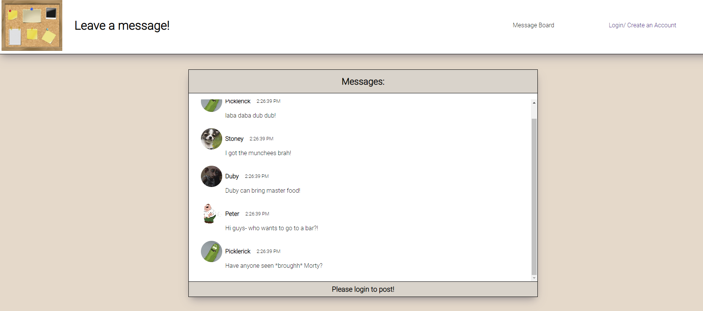

# Message Board
 
Let's get in touch!
 
# Table of Contents
 
<ul>
  <li>General Info</li>
  <li>Technologies</li>
  <li>Setup</li>
  <li>Features</li>
  <li>Improvments for future</li>
  <li>Contacts</li>
</ul>
 
# General Info
 
This app is designed to imitate a message board app where people can leave a message, edit and delete their messages. For this app I used a "fake auth"--where the user is saved on the state (so refreshing the page will start from scratch). Also important to note: since I haven't really used any satling for the password, make sure that you don't use any of your real passwords when creating a new user because it is NOT SECURED!
 
# Technologies
 
<ul>
<li>React</li>
<li>HTML</li>
<li>CSS</li>
<li>Javascript</li>
<li>Material-UI</li>
<li>JSON</li>
<li>ActiveRecord</li>
<li>Sinatra</li>
<li>Ruby</li>
</ul>
 
# Setup
 
To run this project: <ol>
 
  <li>Clone the repo to your computer</li>
  <li>Clone  <a href="https://github.com/levydlior/message-board-back-end" target="_blank">This repo back end</a>  repo to the same directory as the message board front end</li>
  <li>Go to the Message Board front end directory and npm install</li>
  <li>Still in the same directory run npm start to run the react app</li>
  <li>Go to the Message Board back end directory and bundle install</li>
  <li>Still in the same directory run take server to  run Sinatra server</li>
  <li>Go to http://localhost:3000/ and start exploring the app!</li>
  </ol>
 
# Features
 
<ul>
  <li>Get messages from the backend and render them on the message board--will also fetch additional user info such as name and avatar</li>
  <li>Create a user (will throw an error if the user name exists)</li>
  <li>Login as a user (will throw an error if the username and or password are wrong)</li>
  <li>Post a new message to the board</li>
  <li>Edit your message on the board</li>
  <li>Delete your message on the board</li>
  <li>Edit your avater picture</li>
  <li>Delete your account which will also remove your messages from the board</li>
  <li>Responsive design</li>
</ul>
 
# Improvements for future
 
It was interesting and definitely challenging to work on this project by myself. Here are a few things I could improve in the future:
<ul>
<li>Refactoring the code -- I definitely used the same elements (for example edit button) across the app and In the future I could extract elemnts I use a few times into their own components</li>
<li>Inline styling-- I used some inline styling which generally should be avoided</li>
<li>CSS - I used one CSS file which ends up being excessively big. In the future I should use styled component</li>
<li>Lastly a thing that will be good to add to the message board will be infinite scroll- at the moment there are only a few messages which is not a problem but if we would have had 100 messages for example it might take longer for our fetch request.</li>
</ul>
 
# Contacts
 
Created by  
<a href="https://www.linkedin.com/in/liordl/" target="_blank">Lior Levy</a> 
 
web logo has been taken from:
https://www.vectorstock.com/royalty-free-vector/items-pinned-to-a-cork-message-board-vector-7624281
 

 

